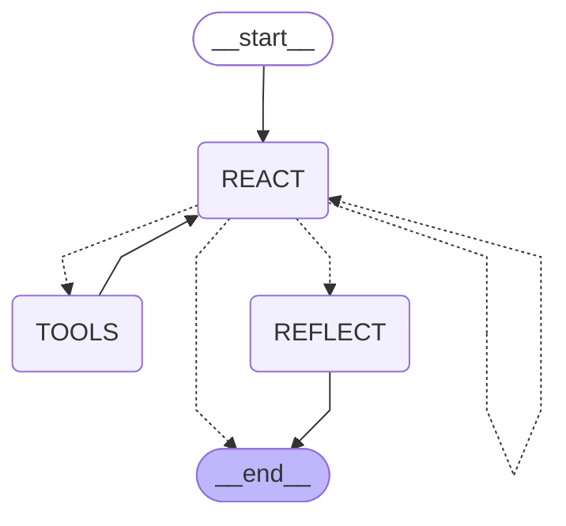

```mermaid
---
config:
  flowchart:
    curve: linear
---
graph TD;
	__start__([<p>__start__</p>]):::first
	REACT(REACT)
	TOOLS(TOOLS)
	REFLECT(REFLECT)
	__end__([<p>__end__</p>]):::last
	REACT -.-> REFLECT;
	REACT -.-> TOOLS;
	REACT -.-> __end__;
	TOOLS --> REACT;
	__start__ --> REACT;
	REFLECT --> __end__;
	REACT -.-> REACT;
	classDef default fill:#f2f0ff,line-height:1.2
	classDef first fill-opacity:0
	classDef last fill:#bfb6fc

```