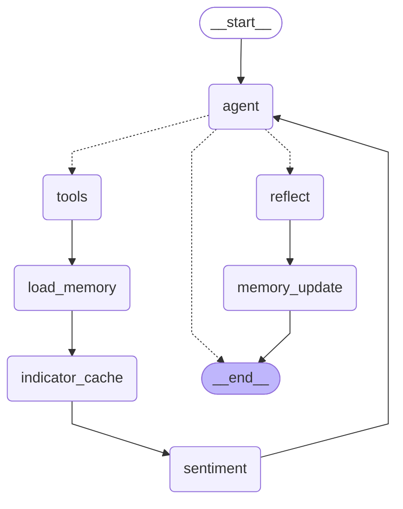

```mermaid
---
config:
  flowchart:
    curve: linear
---
graph TD;
	__start__([<p>__start__</p>]):::first
	agent(agent)
	tools(tools)
	load_memory(load_memory)
	indicator_cache(indicator_cache)
	sentiment(sentiment)
	reflect(reflect)
	memory_update(memory_update)
	__end__([<p>__end__</p>]):::last
	__start__ --> agent;
	agent -.-> __end__;
	agent -.-> reflect;
	agent -.-> tools;
	indicator_cache --> sentiment;
	load_memory --> indicator_cache;
	reflect --> memory_update;
	sentiment --> agent;
	tools --> load_memory;
	memory_update --> __end__;
	classDef default fill:#f2f0ff,line-height:1.2
	classDef first fill-opacity:0
	classDef last fill:#bfb6fc

```