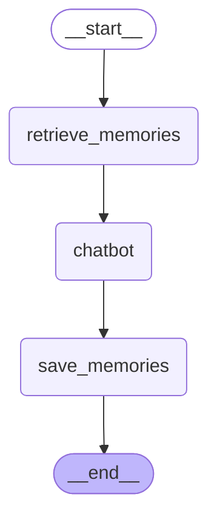

```mermaid
---
config:
  flowchart:
    curve: linear
---
graph TD;
	__start__([<p>__start__</p>]):::first
	retrieve_memories(retrieve_memories)
	chatbot(chatbot)
	save_memories(save_memories)
	__end__([<p>__end__</p>]):::last
	__start__ --> retrieve_memories;
	chatbot --> save_memories;
	retrieve_memories --> chatbot;
	save_memories --> __end__;
	classDef default fill:#f2f0ff,line-height:1.2
	classDef first fill-opacity:0
	classDef last fill:#bfb6fc

```