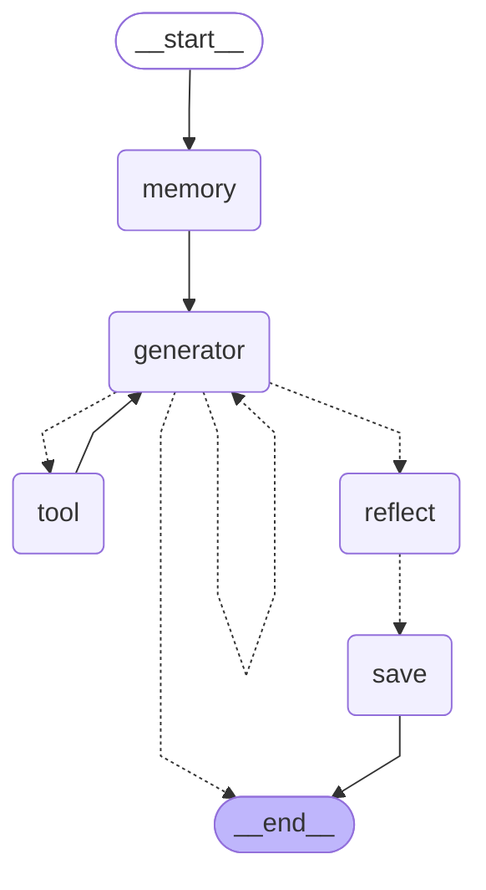

# 🧠 Offline Personal Assitance Agent

### Reflection-Based Self-Learning AI (Fully Offline)

An advanced **privacy-first, offline identity engine** that learns to speak exactly like you by combining:

* 📄 Private document retrieval
* 💬 Past conversation memory
* 🧠 Semantic vector search (pgvector)
* 🔁 Self-reflection & quality scoring
* 🎯 Automatic style evolution

No cloud.
No telemetry.
No external APIs.
100% local.

---

# 🚀 What This Project Is

This is **not** a generic chatbot.

It is a **self-improving digital identity system** designed to:

* Speak in your natural tone
* Maintain personality consistency
* Retrieve relevant private knowledge
* Learn from high-quality answers
* Improve style automatically over time
* Operate completely offline

It represents the user — not an assistant.

---

# 🏗 Core Architecture

Built using:

* **LangGraph** → Stateful workflow engine
* **PostgreSQL + pgvector** → Long-term semantic memory
* **Local LLM** → Offline inference
* **Local Embeddings Model** → Vector generation
* **Reflection Module** → Answer evaluation & learning

---

# 🔁 Reflection-Based Agent Flow

The current production engine is:

```
Agent/reflection_agent.py
```

Graph Workflow:


---

# 🧠 How the Reflection System Works

### 1️⃣ Memory Retrieval

* Searches private documents (RAG)
* Searches similar past chats
* Loads role-specific style guide

### 2️⃣ Generation

* Produces answer
* May call a tool once
* Generates natural, concise response

### 3️⃣ Reflection (Core Innovation)

The agent:

* Rates its own answer (1–5)
* Extracts strong response patterns
* Identifies style signals
* Stores lessons for future improvement

Reflection is **non-destructive** — it never drops valid responses.

### 4️⃣ Learning

If answer quality ≥ threshold:

* Chat is stored
* Metadata saved
* Style guide may be updated
* Agent evolves

---

# 🎯 Key Features

* ✅ Fully offline LLM
* ✅ Fully offline embeddings
* ✅ PostgreSQL + pgvector vector search
* ✅ Semantic document retrieval (RAG)
* ✅ Chat history retrieval
* ✅ Self-reflection scoring
* ✅ Automatic style guide evolution
* ✅ Per-role personality modeling
* ✅ Persistent long-term memory
* ✅ Identity-locked responses
* ✅ No assistant-style contamination

---

# 📂 Project Structure

```
PersonalAgent/
│
├── Agent/
│   ├── config.py
│   ├── db_postgresql.py
│   ├── document_reader.py
│   ├── reflection_agent.py     # 🔥 Production agent (latest)
│   ├── llm.py
│   ├── logger.py
│   ├── schemas.py
│   ├── ui.py
│   └── __init__.py
│
├── data/                       # Private documents
├── logs/                       # Local logs
├── style_guides/               # Auto-evolving style guides
├── graphs/                     # Agent graph visualizations
├── run.py                      # Entry point
└── README.md
```

---

# 🔐 Privacy Model

This system guarantees:

* ❌ No OpenAI API usage
* ❌ No cloud calls
* ❌ No telemetry
* ❌ No data sharing
* ❌ No external inference
* ✅ Local embeddings
* ✅ Local vector storage
* ✅ Local chat history
* ✅ Full data sovereignty

Designed for private use environments.

---

# 🛠 Requirements

## Python

Python 3.10+

---

## PostgreSQL + pgvector

Enable vector extension:

```sql
CREATE EXTENSION IF NOT EXISTS vector;
```

---

## Install Dependencies

```bash
pip install -r requirements.txt
```

Typical dependencies:

```
langchain
langchain-community
langchain-ollama
langgraph
prompt-toolkit
colorama
pydantic
tqdm
psycopg
```

---

# ⚙️ Setup

## 1️⃣ Configure Database

Edit:

```
Agent/config.py
```

```python
DB_CONFIG = {
    "host": "localhost",
    "port": 5433,
    "dbname": "personalagent",
    "user": "postgres",
    "password": <password>,
}
```

---

## 2️⃣ Add Private Documents

Place files inside:

```
data/
```

On first run they are:

* Loaded
* Chunked
* Embedded
* Stored in PostgreSQL

---

# ▶️ Running the Agent

From project root:

```bash
python3 run.py
```

Startup flow:

1. Connect to PostgreSQL
2. Sync documents
3. Initialize reflection agent
4. Auto-run: **"Introduce yourself"**
5. Start interactive chat

Example:

```
User: What are the joining date in accenture offer letter?
Agent: The joining date is March 30, 2026.
```

---

# 🗄 Database Tables

### documents

Raw file content + metadata

### document_chunks

Chunk embeddings (`VECTOR(n)`)

### chat_history

Stores:

* user_id
* role
* human_text
* ai_text
* embedding
* reflection metadata (rating, lessons, summary)

Optimized using `ivfflat` index for fast similarity search.

---

# 📊 Graph Visualization

Automatically saved:

```
graphs/personalAgent_reflection.md
graphs/personalAgent_reflection.png
```

---

# 🧪 Use Cases

* Personal digital twin
* Executive assistant (offline)
* Knowledge memory engine
* Research identity system
* Founder memory assistant
* Secure enterprise AI
* Persona-consistent responder

---

# ⚠️ Important Notes

This agent:

* Mimics tone and phrasing
* Reuses learned language patterns
* References private documents
* Evolves with usage

It is designed strictly for **private local deployment**.

Do not expose publicly without access control.

---

# 🔮 Roadmap

Planned enhancements:

* Advanced style fingerprint modeling
* Sentence-length distribution learning
* Emoji and punctuation modeling
* Async background learning
* Multi-user identity separation
* Encrypted database storage
* Autonomous memory consolidation

---

# 📜 License

Private / Internal Use Only

