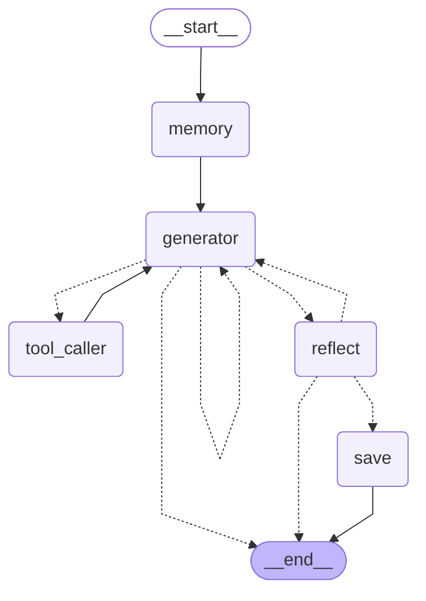

```mermaid
---
config:
  flowchart:
    curve: linear
---
graph TD;
	__start__([<p>__start__</p>]):::first
	memory(memory)
	generator(generator)
	tool_caller(tool_caller)
	reflect(reflect)
	save(save)
	__end__([<p>__end__</p>]):::last
	__start__ --> memory;
	generator -.-> __end__;
	generator -.-> reflect;
	generator -.-> tool_caller;
	memory --> generator;
	reflect -.-> __end__;
	reflect -.-> generator;
	reflect -.-> save;
	tool_caller --> generator;
	save --> __end__;
	generator -.-> generator;
	classDef default fill:#f2f0ff,line-height:1.2
	classDef first fill-opacity:0
	classDef last fill:#bfb6fc

```