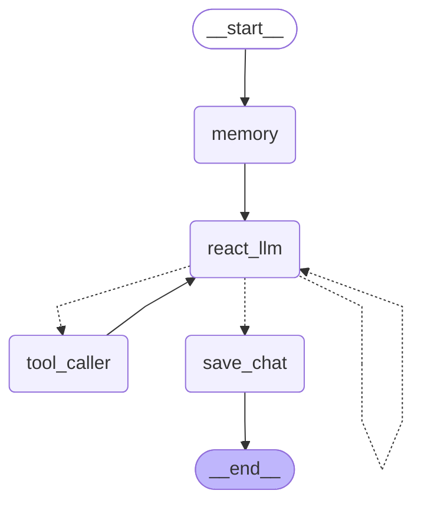

```mermaid
---
config:
  flowchart:
    curve: linear
---
graph TD;
	__start__([<p>__start__</p>]):::first
	memory(memory)
	react_llm(react_llm)
	tool_caller(tool_caller)
	save_chat(save_chat)
	__end__([<p>__end__</p>]):::last
	__start__ --> memory;
	memory --> react_llm;
	react_llm -.-> save_chat;
	react_llm -.-> tool_caller;
	tool_caller --> react_llm;
	save_chat --> __end__;
	react_llm -.-> react_llm;
	classDef default fill:#f2f0ff,line-height:1.2
	classDef first fill-opacity:0
	classDef last fill:#bfb6fc

```