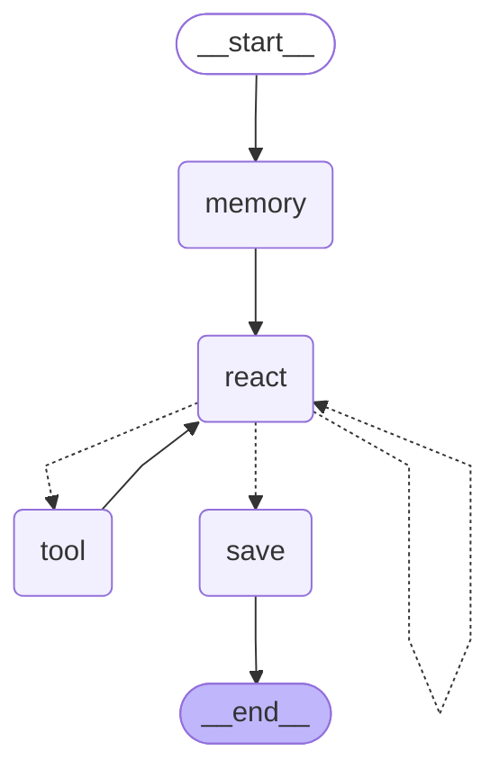

```mermaid
---
config:
  flowchart:
    curve: linear
---
graph TD;
	__start__([<p>__start__</p>]):::first
	memory(memory)
	react(react)
	tool(tool)
	save(save)
	__end__([<p>__end__</p>]):::last
	__start__ --> memory;
	memory --> react;
	react -.-> save;
	react -.-> tool;
	tool --> react;
	save --> __end__;
	react -.-> react;
	classDef default fill:#f2f0ff,line-height:1.2
	classDef first fill-opacity:0
	classDef last fill:#bfb6fc

```